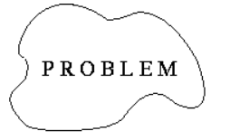
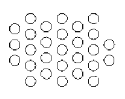
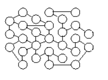
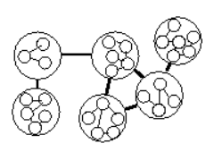

# Design Under PCAM Methodology

## Contents

- [¿What is PCAM?](#¿What-is-PCAM?)
	- [P - Partitioning](#p---partitioning)
	- [C - Communication](#C---Communication)
	- [A - Agglomeration](#A---Agglomeration)
	- [M - Mapping](#M---Mapping)
- [Designing our parallel algorithm](#Designing-our-parallel-algorithm)

## ¿What is PCAM?

This methodology structures the design process as four distinct stages: partitioning, communication, agglomeration, and   mapping. (The acronym PCAM may serve as a useful reminder of this structure.) In the first two stages, we focus on concurrency and scalability and seek to discover algorithms with these qualities. In the third and fourth stages, attention shifts to locality and other performance-related issues.

### P - Partitioning
The computation that is to be performed and the data operated on by this computation are decomposed into small tasks. Practical issues such as the number of processors in the target computer are ignored, and attention is focused on recognizing opportunities for parallel execution.

### C - Communication
The communication required to coordinate task execution is determined, and appropriate communication structures and algorithms are defined.

### A - Agglomeration
The task and communication structures defined in the first two stages of a design are evaluated with respect to performance requirements and implementation costs. If necessary, tasks are combined into larger tasks to improve performance or to reduce development costs.

### M - Mapping
Each task is assigned to a processor in a manner that attempts to satisfy the competing goals of maximizing processor utilization and minimizing communication costs. Mapping can be specified statically or determined at runtime by load-balancing algorithms.

## Designing our parallel algorithm

## References

[1]https://www.mcs.anl.gov/~itf/dbpp/text/node15.html
[2]http://homepage.physics.uiowa.edu/~ghowes/teach/ihpc12/lec/ihpc12Lec_DesignHPC12.pdf

<!--stackedit_data:
eyJoaXN0b3J5IjpbMTgwNjE1MjkwOCw4ODU3Mzg5NDcsLTEwMz
Y3NzEwOTVdfQ==
-->